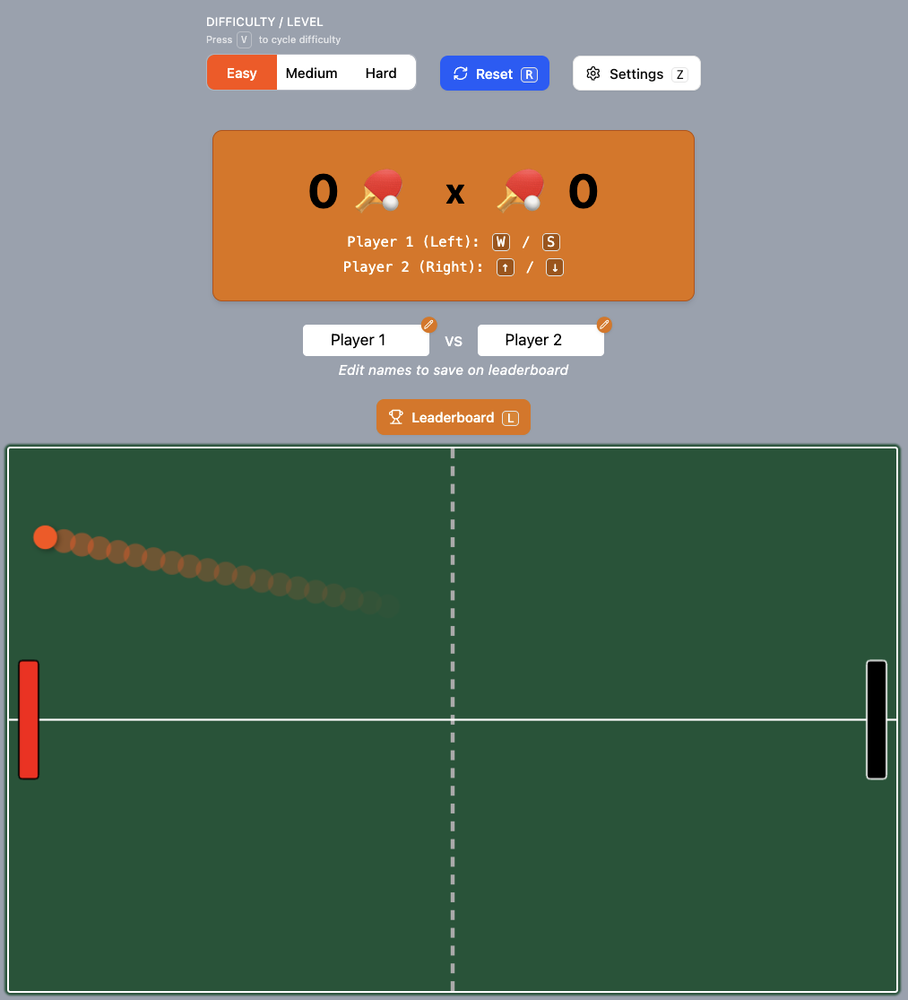

# 🕹️ Make Labs - Pong Game — React + TypeScript + Vite

<p align="center">
  
</p>

This is a modern Pong-style game built using **React**, **TypeScript**, and **Vite**, created as part of a coding challenge.  
It demonstrates modular architecture, real-time canvas rendering, keyboard input tracking, state management via React Context, and developer-friendly features like a debug panel and settings toggles.

Key features include:

- 🌀 **Frame-rate independent game loop** using `requestAnimationFrame`
- 🎹 **Two-player simultaneous controls**
- 🏓 **Dynamic bounce physics**
- 🎛️ **Developer utilities** (reset, debug box, toggle panel)
- 🧠 **Difficulty system** with local persistence
- 🏆 **Leaderboard** stored in `localStorage`
- 🌪️ **Canvas trail effect** & styled game board

---

## ▶️ Getting Started

Follow these steps to run the project locally:

```bash
# 1. Clone the repository
# Not needed if has the .zip file.
git clone https://github.com/your-username/your-repo-name.git
cd pong-game

# 2. Install dependencies
npm install

# 3. Start the development server
npm run dev
```

The app will be available at `http://localhost:5173` by default.

---

## ⌨️ Keyboard Shortcuts (gameplay)

| Key       | Action                           |
| --------- | -------------------------------- |
| `W` / `S` | Move  **Left Paddle** Up / Down  |
| `↑` / `↓` | Move  **Right Paddle** Up / Down |
| `R`       | Reset the game                   |
| `Enter`   | Starts the game                  |
| `Enter`   | Starts next turn when scoring    |
| `Enter`   | Play again after game over       |
| `Z`       | Toggle settings panel            |
| `T`       | Toggle ball trail                |
| `B`       | Toggle dynamic bounce            |
| `D`       | Toggle debug info                |
| `L`       | Toggle leaderboard view          |

ℹ️ All shortcuts are case-insensitive and work without requiring the canvas to be focused.


---

## 📒 Full Development Notes

For in-depth explanations, architecture decisions, and implementation tips, check the complete notes:

👉 [`/notes.md`](./notes.md)

---

## 🧪 Testing

Automated tests are not yet included due to time constraints. See [notes](./notes.md#-why-automated-tests-were-not-included) for reasoning and next steps.

---

## 🛠️ Tech Stack

- [React](https://reactjs.org/)
- [TypeScript](https://www.typescriptlang.org/)
- [Vite](https://vitejs.dev/)
- [Tailwind CSS](https://tailwindcss.com/)
- [Framer Motion](https://www.framer.com/motion/)
- [Lucide Icons](https://lucide.dev/)
