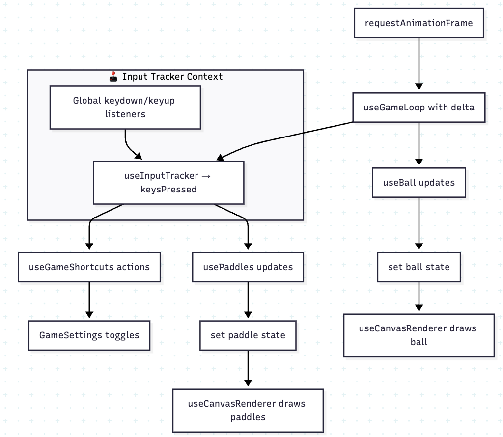

# Make Labs Ping-Pong Game

This document contains incremental notes describing my thought process, design decisions, trade-offs, and what I would improve with more time.

## 📑 Table of Contents

1. [➡️ Step 1: Setup](#️-step-1-setup)
2. [➡️ Step 2: Game Loop and Ball Movement](#️-step-2-game-loop-and-ball-movement)
3. [➡️ Step 3: Paddles and Player Controls](#️-step-3-paddles-and-player-controls)
4. [➡️ Step 4: Paddle Collision and Dynamic Bounce](#️-step-4-paddle-collision-and-dynamic-bounce)
5. [➡️ Step 5: Architecture Refactor – Hooks, Utils & Constants](#️-step-5-architecture-refactor--hooks-utils--constants)
6. [➡️ Step 6: Enhancements and Shortcuts](#️-step-6-enhancements-and-shortcuts)
7. [➡️ Step 7: Game Flow – Score System, Countdown, Dynamic Serve & Realistic Starts](#️-step-7-game-flow--score-system-countdown-dynamic-serve--realistic-starts)
8. [➡️ Step 8: Visual Polish — Trail, Table, UI, Score Plate](#️-step-8-visual-polish--trail-table-ui-score-plate)
9. [➡️ Step 9: Difficulty Levels & Leaderboard Multi-Ball Planned](#️-step-9-difficulty-levels--leaderboard-multi-ball-planned)
10. [➡️ Future Steps, Improvements & Ideas](#️-future-steps-improvements--ideas)
11. [🧪 Why Automated Tests Were Not Included](#-why-automated-tests-were-not-included)
12. [🧾 Glossary](#-glossary)

---

## ➡️ Step 1: Setup

I chose **React + TypeScript + Vite** (besides to be the ask in the challenge instructions) for fast development, strong typing, and modern bundling. `Tailwind CSS` was added early to keep layout and styling consistent with the Make Labs stack. This setup offers strong developer experience and enables clean component structure.

---

## ➡️ Step 2: Game Loop and Ball Movement 
> ⚠️ **Note:** The implementation described in this step has since been refactored into modular hooks and utilities (see Step 5). This section documents the original logic before modularization for historical clarity.

### 🎯 Goal
Create a smooth, frame-consistent ball animation inside a canvas.

### 🔹 Why I Used `requestAnimationFrame`
I implemented a custom game loop using `requestAnimationFrame` to handle the ball movement. This method was chosen over alternatives like `setInterval` or `setTimeout` because:

- It syncs with the browser's **refresh rate** (usually 60fps), providing smoother animations.
- It **automatically pauses** when the user switches tabs, improving performance and battery life.
- It avoids **frame drops and jitter** common with `setInterval`.

### 🔹 Efficient Canvas Drawing
Instead of redrawing on every frame inside `requestAnimationFrame`, I only redraw the canvas when the state updates (`ball`, `paddles`) via `useEffect`. Since state changes are triggered within the game loop, this approach keeps rendering fast while making React state observable and debug-friendly.

### 🔹 Delta Time

I calculate the `delta` (time between frames) to ensure consistent movement across different devices and performance levels. Without `delta`, faster devices would make the ball move faster.

Example:

```ts
x += vx * delta
````

This keeps physics simulation frame-rate independent, a common technique in both 2D and 3D games.

### 🔹 Frame Independence
This technique ensures consistent behavior whether the game is running at 30fps or 144fps. Without delta, faster devices would cause the ball and paddles to move faster than intended.

### 🔹 Rendering
Rendering is handled with the native HTML <canvas> using the 2D context. This gives me full pixel-level control while keeping performance high for a simple 2D game like Pong.


### 🔹 Why `<canvas>` Instead of DOM Elements?
Canvas gives me full control over rendering, avoids layout reflows, and better mimics real game environments. It's also more performant and scalable for game features like particles, effects, or possible Three.js animations later.

### 🔹 Reusability
The loop is abstracted into a useGameLoop hook to keep logic modular and testable, and make it easier to apply in other parts of the game (e.g., for paddles or AI movement).

### 📚 Further Reading
If you're curious about this subject, like I was, you can take a brief look on this article:

- [Game Loop – Game Programming Patterns](https://gameprogrammingpatterns.com/game-loop.html)
  - This article explains how to design a frame-consistent game loop using delta time, input polling, and update-render separation. It's a foundational technique used in most professional games and aligns with the architecture I used here.
- [Delta time - Understanding delta time in games]( https://dev.to/dsaghliani/understanding-delta-time-in-games-3olf)
  - A concise explanation of how delta time works, why it's important for consistent movement across devices, and how to implement it in simple games. Great for beginners or frontend devs transitioning into game mechanics.

---

## ➡️ Step 3: Paddles and Player Controls
> ⚠️ **Note:** The implementation described in this step has since been refactored into modular hooks and utilities (see Step 5). This section documents the original logic before modularization for historical clarity.

### 🎯 Goal
Render two paddles on the canvas and allow two players to control them simultaneously:

- Player 1 (left paddle): `W` and `S`
- Player 2 (right paddle): `ArrowUp` and `ArrowDown`

### 🔹 Keyboard Handling
I implemented global `keydown` and `keyup` listeners to track which keys are being held down. Instead of reacting to individual events, I maintain an object (`keysPressed.current`) that keeps track of all active keys in real-time.

This approach supports:
- Simultaneous key presses (both players can move at once)
- Smooth and continuous movement while keys are held

Example logic:
```ts
if (keysPressed.current["w"]) leftY -= speed * delta
if (keysPressed.current["ArrowDown"]) rightY += speed * delta
```

While global `keydown`/`keyup` handlers may seem broad, they're extremely lightweight and standard for games. Filtering key states in a ref (`keysPressed.current`) is far more efficient than using `useState` or rerendering on every keystroke.

### 🔹 Integration with Game Loop
The paddle update logic runs inside the same requestAnimationFrame-powered useGameLoop:
- It checks key states each frame
- It applies movement scaled by delta
- It clamps the paddles within the canvas height

This allows paddle motion to remain smooth, frame-rate independent, and integrated with other game mechanics like ball movement.

### 🔹 Why This Approach?
This model mirrors how games typically handle input:
- Track key state, not events
- Separate input polling from animation rendering
- Keep real-time responsiveness

It avoids jerky movement or missed inputs and simplifies new features later (e.g. AI or touch control).

### 🔹 Diagram: Game Loop and Input Integration


---

## ➡️ Step 4: Paddle Collision and Dynamic Bounce
> ⚠️ **Note:** The implementation described in this step has since been refactored into modular hooks and utilities (see Step 5). This section documents the original logic before modularization for historical clarity.

### 🎯 Goal
Detect when the ball hits either paddle and bounce it back. Additionally, add variation to the bounce angle based on where the ball strikes the paddle — creating a more dynamic and skill-based experience (making more 
difficult to preview where the ball goes).

### 🔹 Collision Detection Logic
To check if the ball intersects a paddle, I implemented a basic *AABB (Axis-Aligned Bounding Box)* collision check:
```ts
const paddleCollision = (
  ballX, ballY,
  paddleX, paddleY,
  paddleW, paddleH
) => {
  return (
    ballX >= paddleX &&
    ballX <= paddleX + paddleW &&
    ballY >= paddleY &&
    ballY <= paddleY + paddleH
  )
}
```
This is called once per frame for each paddle during the game loop.

#### ↪️  Basic Bounce Behavior
When a collision is detected, the ball's horizontal velocity is inverted:
```ts
vx *= -1
```
To prevent the ball from sticking inside the paddle, I also slightly reposition the ball to just outside the collision boundary.

#### ↪️  Angle Variation with Hit Point
> ⚠️ **Note:** The implementation described in this sub-heading has since been refactored (see Step 6). This section documents the original logic before modularization for historical clarity. On Step 6, it's called `DynamicAngleBounce` and can be toggled for better interviewer testing.

To make the gameplay feel more natural and responsive, I added vertical deflection based on _where_ the ball hits the paddle:
```ts
const hitPoint = (ballY - (paddleY + paddleH / 2)) / (paddleH / 2)
vy += hitPoint * 0.3
```
- If the ball hits the center of the paddle → hitPoint = 0 → straight bounce
- If the ball hits near the top → hitPoint = -1 → upward deflection
- If the ball hits near the bottom → hitPoint = +1 → downward deflection

This behavior gives the player a sense of agency over the ball's direction, turning paddle position into a strategy tool — just like real-life table tennis or air hockey. It’s a simple tweak that adds emergent depth.

### 🔹 Outcome
- Ball now bounces off paddles with dynamic angles
- Makes gameplay feel less robotic and more skill-driven
- Adds replayability and realism while maintaining clean logic

---

## ➡️ Step 5: Architecture Refactor – Hooks, Utils & Constants

### 🎯 Goal
Reorganize the growing game logic into modular, testable units with clear responsibilities.

### 🔹 Motivation
As the game evolved, the GameCanvas component began handling too much logic — ball movement, collision detection, paddle state, and rendering. To improve clarity and scalability, I split responsibilities into dedicated hooks and utility files.

### 🔹 What Was Done
- `useBall` manages ball state and physics.
- `usePaddles` tracks paddle positions and handles input.
- `useGameLoop` provides a clean, reusable animation loop using `requestAnimationFrame`.
- `useCanvasRenderer` handles low-level canvas rendering.
- `useInputTracker` abstracts keyboard state tracking.
- `physics.ts` centralizes pure utility logic: collision detection, bounce physics, wall interaction.
- `constants.ts` defines all static game values in one place: sizes, speeds, offsets.
- All variables use clear, descriptive names for better readability (e.g., `velocityX` instead of `vx`).

### 🔹  Benefits
- **Easier to reason about:** Each file does one thing well.
- **Easier to test/debug:** Pure functions are now isolated.
- **More reusable:** Game loop and canvas renderer could be reused across features (e.g. menus, animations).
- **Cleaner component:** `GameCanvas` is now declarative and focused on composition, not logic.

### 🔹 Diagram: Updated game flow after refactors


This kind of modularization mirrors common architecture in game engines (e.g., Unity's component system, ECS patterns), promoting separation of concerns and testability.

---

## ➡️ Step 6: Enhancements and Shortcuts

### 🎯 Goal
Introduce user-facing enhancements and keyboard shortcuts for improved gameplay experience and developer testing.

### 🔹 Reset Button
A `<ResetButton />` was added to allow restarting the game mid-session. This action resets:
- Ball position and direction
- Paddle positions

### 🔹 Settings Menu
A `<SettingsDropdown />` component was introduced to toggle advanced options:
- Show/Hide Ball Trail (to be implemented)
- Enable/Disable Dynamic Bounce
- Show Debug Info Box

The settings UI uses `z-index` layering and absolute positioning within the canvas wrapper.

### 🔹 Game Settings Context
All configuration toggles are managed via a global `GameSettingsContext`. It exposes and controls state like:
- `isSettingsOpen`
- `isDebugInfoVisible`
- `isBallTrailEnabled`
- `isDynamicBounceEnabled`

This context centralizes UI and logic concerns, allowing both keyboard shortcuts and UI components to stay in sync.

### 🔹 Migration from Hook to Context: useInputTracker
I initially handled keyboard input using a combination of `useInputTracker`(as a hook, for keydown/keyup register) and `useDebouncedKeyPress`(for debouncing). In this step, I replaced it with a context-based `InputTrackerContext` to simplify the architecture and improve consistency.

This refactor offers:
- **Global access** to key state without setting up listeners in every hook.
- **Frame-based polling** that fits naturally into the `useGameLoop`.
- **Cleaner separation of concerns**, keeping input logic isolated and shared.

While not strictly necessary for a small game, this change mirrors patterns used in larger apps and improves reusability and maintainability even in simpler projects.

### 🔹 UI Components with `shadcn/ui`
To maintain consistency with Tailwind CSS and reduce boilerplate, I used [shadcn/ui](https://ui.shadcn.com/) for interactive elements like:
- `<Switch />` components in the settings menu
- Toggle buttons and dropdowns

This library provides accessible, headless UI primitives styled with Tailwind, which fit naturally into the project’s tech stack and visual style. It also allows for easy customization without losing design coherence.

### 🔹  Keyboard Shortcuts
Instead of listening for keyboard input directly in each feature, I introduced a reusable system:
- `useInputTracker` listens to global keydown/keyup and stores active keys in a ref.
- `useGameShortcuts` polls keys per frame inside the game loop and maps actions to keys.

This ensures:
- Each frame, keys are polled inside the game loop and manually debounced to ensure a single action per press.
- Scalable and declarative shortcut registration via `shortcutMap`

Current shortcuts:
| Key | Action |
| :--- | :--- |
| ` r ` | Reset game |
| ` z ` | Toggle settings menu |
| ` t ` | Toggle ball trail |
| ` b ` | Toggle dynamic bounce |
| ` d ` | Toggle debug info |

All shortcuts are lowercase, and mappings are defined in a centralized `constants/shortcuts.ts` file.

Future: Additional shortcuts (e.g., speed multiplier, pause, or AI mode) can be added declaratively via the existing `shortcutMap` in `useGameShortcuts`.

### 🔹 Diagram: Updated game flow after enhancements


This kind of modularization mirrors common architecture in game engines (e.g., Unity's component system, ECS patterns), promoting separation of concerns and testability.

---

## ➡️ Step 7: Game Flow – Score System, Countdown, Dynamic Serve & Realistic Starts

### 🎯
Transition from a technical demo to a full game loop with:
- **Score tracking** per player
- **Serve overlay** with countdown animation
- **Randomized serving side** after each goal
- **Randomized serve angles** for realism and variation

### 🔹 Score Logic & Win Detection (in progress)
The game now tracks and displays the score for each player:
- Scoring occurs when the ball crosses the left or right bounds.
- Scores are updated using a centralized `GameStatsContext`.
- `onScore` logic handles game pause, serve reset, and UI feedback.

While win detection is planned, the current system enables real-time score updates and will be reused for later win-state handling.

### 🔹 Countdown Animation Overlay
Before each round starts (either on game load or after a goal), a **visual countdown** overlays the canvas:
- Countdowns display `3 → 2 → 1 → GO!` using the `<NumberFlow />` animation component and a spring-scale entry.
- During countdown, the ball is paused and centered.
- Players can trigger the countdown via keyboard shortcut (`'Enter'` key). This was implemented using the previous `useGameShortcuts()` solution.

This provides anticipation, pacing, and prevents the game from restarting instantly, giving both players a fair start.

### 🔹 Dynamic Serving Side
After each point, the side that serves is **randomly chosen**:
```ts
const next = Math.random() < 0.5 ? "left" : "right"
handleBallReset(next)
```
- This mimics real-life unpredictability and breaks the deterministic rhythm.
- The serve direction is reflected in the `ServeOverlay`, along with icons and labels like:
  - `Serving: Player 1 ==>`
  - `<== Serving: Player 2`

It adds idea of strategy and anticipation between rounds.

### 🔹 Realistic Initial Serve Angles
To avoid robotic and repetitive bounces, the ball’s initial angle is randomized at the start of each round:

```ts
  const angleDeg = Math.random() * 60 - 30; /* -30° to +30° */
```
- This angle affects both `velocityX` and `velocityY`, creating curved, natural trajectories.
- Combined with dynamic bounce physics, it brings replayability and skill expression.
- Serve direction (`left` or `right`) still determines horizontal polarity of the velocity.

### 🔹 Technical Overview
- `useBall` handles ball state, scoring, and randomized angle generation.
- `useServeController` controls game pause, countdown, and state transitions.
- `ServeOverlay` reflects who’s serving and when the game will resume.
- `GameStatsContext` manages the global score state (`left` and `right`), provides `handleScoreIncrement()` and `handleScoreReset()` methods, 
and ensures consistent score display across the app.

Each responsibility is cleanly split into modular hooks, context providers, and UI components, enabling clear separation of concerns, easier debugging, and scalable expansion (e.g., win detection, stats tracking).

Each responsibility is cleanly split into reusable hooks for clarity and testing.

### 🔹 UX Outcome
- **Score visibility** adds competitive context.
- **Countdowns** make pacing player-friendly.
- **Randomized serves** improve fairness.
- **Angle variation** adds realism and engagement.

Together, these changes elevate the game from a physics sandbox into a structured, competitive two-player experience. At least this is the idea :)

### 🔹 Diagram updated


---

## ➡️ Step 8: Visual Polish — Trail, Table, UI, Score Plate

### 🎯 Goal
Enhance visual clarity, feedback, and style to make the game feel finished, dynamic, and enjoyable to look at — even without major 3D or sound effects.

### 🔹 Ball Trail (with Distance & Opacity Controls)
The ball now leaves behind a smooth fading trail using a circular buffer (`ballTrailRef`) that records past positions:
- Only the last `N` positions (from theme) are rendered.
- Each trail circle fades using the `theme.trail.opacity` setting.
- A new setting `theme.trail.spacing` allows controlling the **distance between each trail dot**, offering precision tuning for visual flow.

This effect:
- Emphasizes ball speed and direction.
- Improves gameplay feedback without affecting physics.
- Adds a subtle "juice" layer common in arcade games.

The trail is toggleable via UI or the keyboard shortcut (`t`), making it easy to enable for visual flair or disable for clean debugging.


### 🔹 Table Styling & Renderer Refactor
I moved all table styling into a centralized `theme.table` object with:
- background: main green hue
- borderColor / borderWidth: white outer lines
- paddingBorder: small inner padding to mimic a real table

In addition, I extracted `renderBall`, `renderTrail`, `renderPaddles`, and `renderNet` into isolated drawing helpers, improving modularity and enabling easier future testing or replacement.

**New visual additions**:
- **Center Net**: White dashed vertical line in the middle of the table
- **Center Line**: Thin horizontal white line across the middle (table design detail)
- **Paddle Border Radius**: Slightly rounded corners to reduce sharpness

This brings the visual design closer to table tennis aesthetics while still fitting within the retro Pong feel.

### 🔹 Score Display with Shortcut Hints
I redesigned the score counter (`<GameScore />`) as a **rounded scoreboard plate**, visually inspired by real-world sports overlays.

I added also a keyboard control legend:
```ts
Player 1 (Left):  [W] / [S]  
Player 2 (Right): [↑] / [↓]
```
This solves the issue where players didn’t know how to move paddles, ensuring that every play session is intuitive without needing onboarding.


### 🔹 Responsive Layering & Overlay Alignment
I fixed previous layout issues where overlays (like the serve countdown) stretched across the full screen.
- All overlays are now constrained to the canvas using a wrapper (`relative` container)
- Overlays are aligned above the canvas (`z-20`) but **do not block UI outside** (`pointer-events-none`)
- Interactive elements (like Start button) are wrapped in `pointer-events-auto` for correct targeting

This creates a **pixel-perfect overlay system** with minimal visual bugs and full control over positioning.

### 🔹 Outcome
- The game now `feels polished`, not just functional.
- Players see real-time feedback via the trail and paddle collisions.
- UI hints make it `self-explanatory and accessible`.
- Visual hierarchy is respected (no overlays misaligned or blocking canvas).

Thanks to this updates, it moves the project from "working prototype" to "delightful game" giving the felling of a really nice game to play. 

### 🔹 Diagram update 


---

## ➡️ Step 9: Difficulty Levels & Leaderboard (Multi-Ball Planned)

### 🎯 Goal
Introduce scalable challenge via difficulty modes and add a persistent leaderboard to boost replayability and player engagement.

### 🔹 Difficulty Selector Implemented
A difficulty toggle was added above the settings button, letting users choose from:
| Difficulty | Ball Speed | Paddle Size | Ball Count               |
| ---------- | ---------- | ----------- | ------------------------ |
| **Easy**   | Normal     | Large       | 1                        |
| **Medium** | Faster     | Medium      | 1                        |
| **Hard**   | Fast       | Small       | *1 (multi-ball planned)* |

The difficulty affects:
- Initial ball velocity
- Paddle height
- (Planned) number of balls for hard mode

The current implementation includes _only one_ ball, regardless of difficulty. However, the code is structured to support multi-ball in future (see below).

#### ↪️ Persistence with localStorage
The selected difficulty is saved to `localStorage` under `pong_difficulty`, so it’s preserved across sessions:
```ts
localStorage.setItem("difficulty", currentDifficulty)
```

### 🔹 Leaderboard System Implemented
A local leaderboard system tracks **total wins per player name**. When a player reaches the win threshold (e.g., 11 following table tennis rules), the game:
- Displays a win message
- Increments the player’s win count
- Stores it in `localStorage` using their chosen name

#### ↪️ Player Name Inputs
Players can edit their names via inline inputs:
```ts
Player 1: [Abner]
Player 2: [Make Interviewer]
```

#### ↪️ Persistence with localStorage
The leaderboard is stored in `localStorage` under `pong_leaderboard`:
```ts
{
  "Make Interviewer": 5
  "Abner": 3,
}
```

#### ↪️ Leaderboard Overlay
A full-screen leaderboard view displays wins per player in a styled table with a Lucide trophy icon. It can be toggled via UI or keyboard shortcut.

### 🔹 Multi-Ball (🚫 Not Implemented)
The "Hard" difficulty mode currently displays that it includes multi-ball, but this feature is not yet implemented due to time constraints.

#### ↪️  Planned Only via Config
The idea of multi-ball is **only represented in the configuration layer** (`difficultyConfig`), where the `"hard"` level includes a `multiBall: true` flag:
```ts
hard: {
    paddleHeight: 80,
    ballSpeedX: 0.85,
    ballSpeedY: 0.45,
    multiBall: true /* For future */,
  },
```
No changes have been made yet to the ball logic, renderer, or game loop to support multiple balls.

This flag was added early as a placeholder for future expansion, but implementing it was postponed due to limited time.

### 🔹 Outcome
- Difficulty mode adds adjustable challenge and feel.
- Leaderboard adds session-spanning progression.
- Multi-ball is a future enhancement, with supporting architecture already in place.

---
## ➡️ Future Steps, Improvements & Ideas

### 🔹 Multi-Ball Gameplay
Implement full support for multiple balls when `multiBall: true`, including:
- Ball array state management in `useBall`
- Collision detection and scoring per ball
- Trail rendering for each ball

This would significantly raise the difficulty and visual intensity, especially in “Hard” mode.

### 🔹 AI Opponent Mode
Introduce a single-player mode with a basic AI-controlled paddle:
- AI tracks ball Y position with a delay factor
- Difficulty could be adjusted via AI reaction speed or error margin. Could be useful for solo play, testing, or demonstrating core mechanics.

### 🔹 Sound Effects (SFX)
Add simple game sounds for:
- Paddle hit
- Score
- Countdown beeps
- Win sound

---

## 🧪 Why Automated Tests Were Not Included
While testing is a fundamental part of modern software development — and easier than ever to integrate with tools like Playwright, Vitest, and even AI-assisted test generation — I made a deliberate decision to **prioritize gameplay mechanics, architecture, and polish** within the limited time frame of this challenge.

My goal was to showcase:
- Deep understanding of real-time animation and canvas rendering
- Clean modularization using hooks, contexts, and utilities
- Scalable architecture for future features (multi-ball, AI, etc.)
- Thoughtful UX decisions and visual details that elevate a simple game

In a production-grade application or a team setting, adding tests would be my immediate next step — especially for:
- Pure utilities (`physics.ts`, collision logic, scoring rules)
- State hooks (`useBall`, `usePaddles`)
- Context behavior (`GameSettingsContext`, `GameStatsContext`)
- UI interactions and settings toggles

This codebase is structured to **make testing straightforward**, with clear separations between side effects, rendering, and pure logic. I’m confident that coverage could be added with minimal friction — and would advocate for doing so if this were a real, ongoing product.

---

## 🧾 Glossary

- **AABB (Axis-Aligned Bounding Box):** A common and efficient collision detection method that compares object edges on the x and y axes.
- **Delta Time:** The time elapsed between frames, used to keep movement consistent across devices.
- **requestAnimationFrame:** A browser API to schedule animations synced to the screen refresh rate, typically 60fps.

